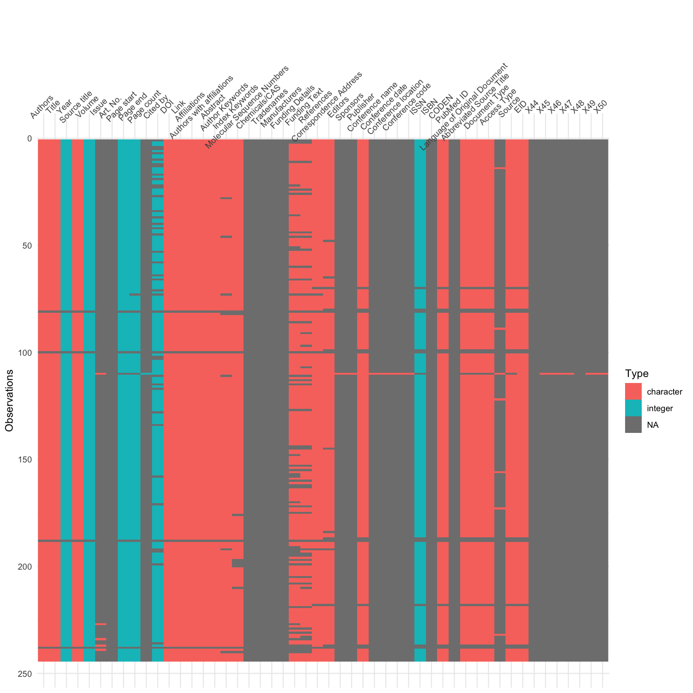
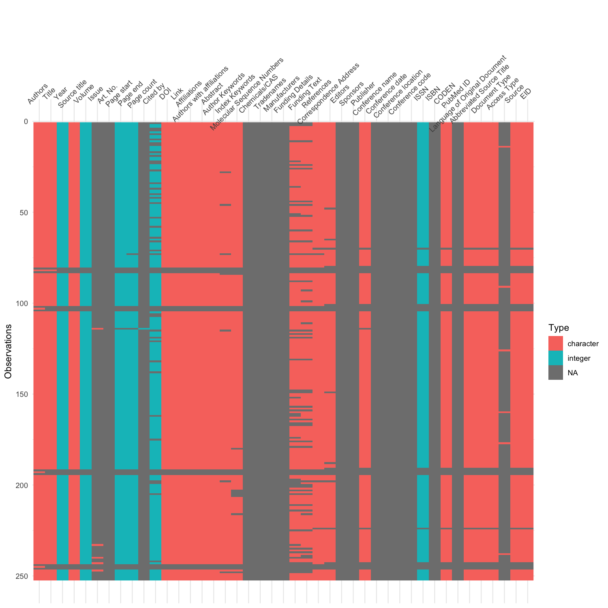

```bash

# found a misaligned row in the original Scopus CSV data.
# to avoid parsing it later, the csv to renamed with "raw" tag.

mv ReviewofPalaeobotanyandPalynology_Scopus.csv ReviewofPalaeobotanyandPalynology_Scopus.raw.csv

# the misalignment can be seen in the ReviewofPalaeobotanyandPalynology_Scopus.raw.csv.png
```

The misaligned row can be seen after 100th row in ReviewofPalaeobotanyandPalynology\_Scopus.raw.csv.png


```bash

# to fix the misaligned row, first a copy of the raw scopus data is made
cp ReviewofPalaeobotanyandPalynology_Scopus.raw.csv ReviewofPalaeobotanyandPalynology_Scopus.csv

# then, open ReviewofPalaeobotanyandPalynology_Scopus.csv and edit the misaligned row in excel
# save the data in CSV format with UTF-8 encoding

# inspect this file with visdat package again to verify the correction
# see ReviewofPalaeobotanyandPalynology_Scopus.csv.png

```

Post correction: ReviewofPalaeobotanyandPalynology\_Scopus.csv.png


```bash

# now this csv file is cleaned with Janitor package to produce the following three tsv files
05-Review_of_Palaeobotany_and_Palynology_Combined_Scopus_Unpaywall.tsv
05-Review_of_Palaeobotany_and_Palynology_Scopus.tsv
05-Review_of_Palaeobotany_and_Palynology_Unpaywall.tsv

# again these tsv files are visually inspected with visdat package
05-Review_of_Palaeobotany_and_Palynology_Combined_Scopus_Unpaywall.tsv.png
05-Review_of_Palaeobotany_and_Palynology_Scopus.tsv.png
05-Review_of_Palaeobotany_and_Palynology_Unpaywall.tsv.png

```

Merged Scopus and Unpaywall data: Review\_of\_Palaeobotany\_and\_Palynology\_Combined\_Scopus\_Unpaywall.tsv.png

