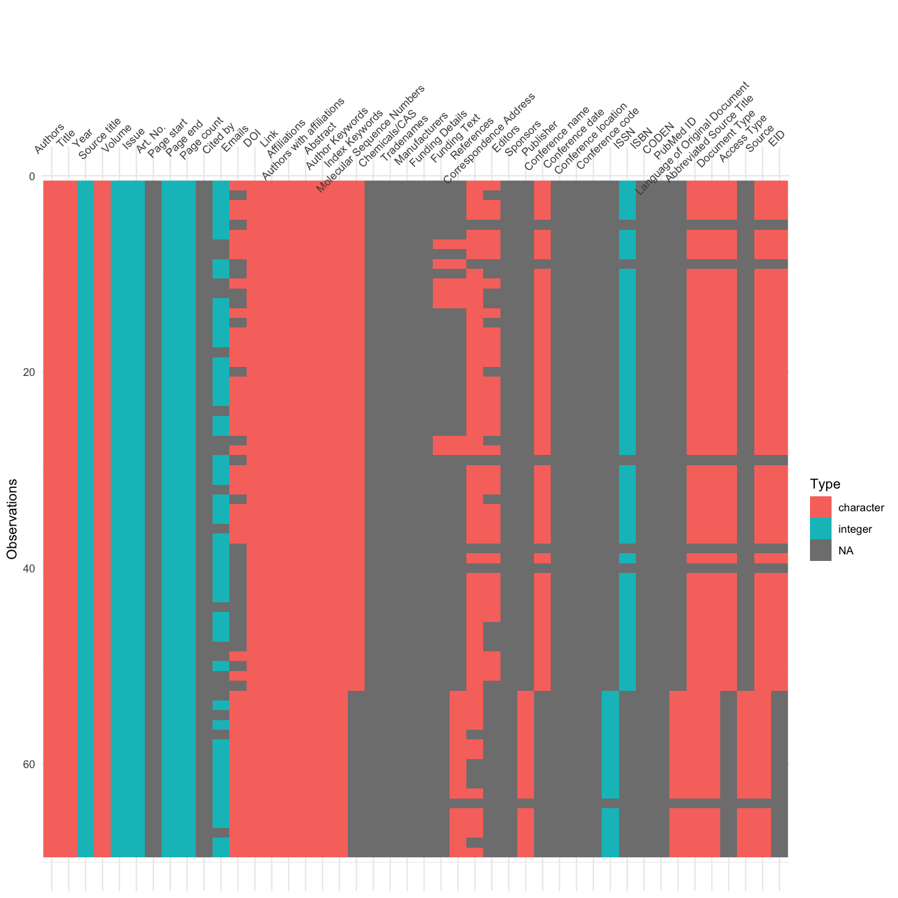
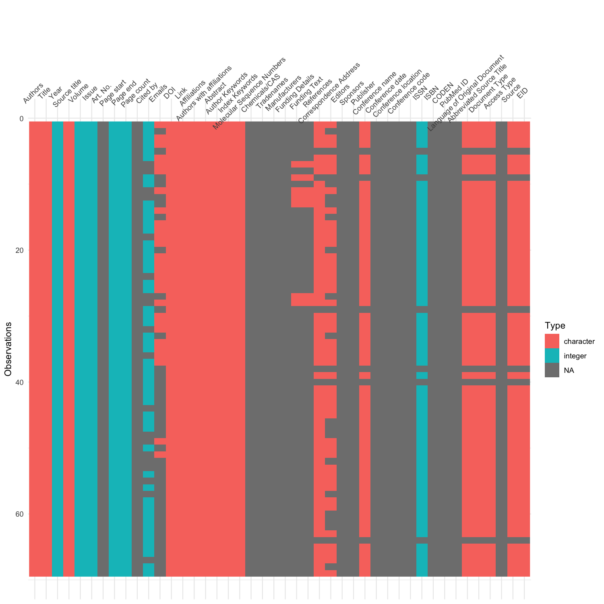
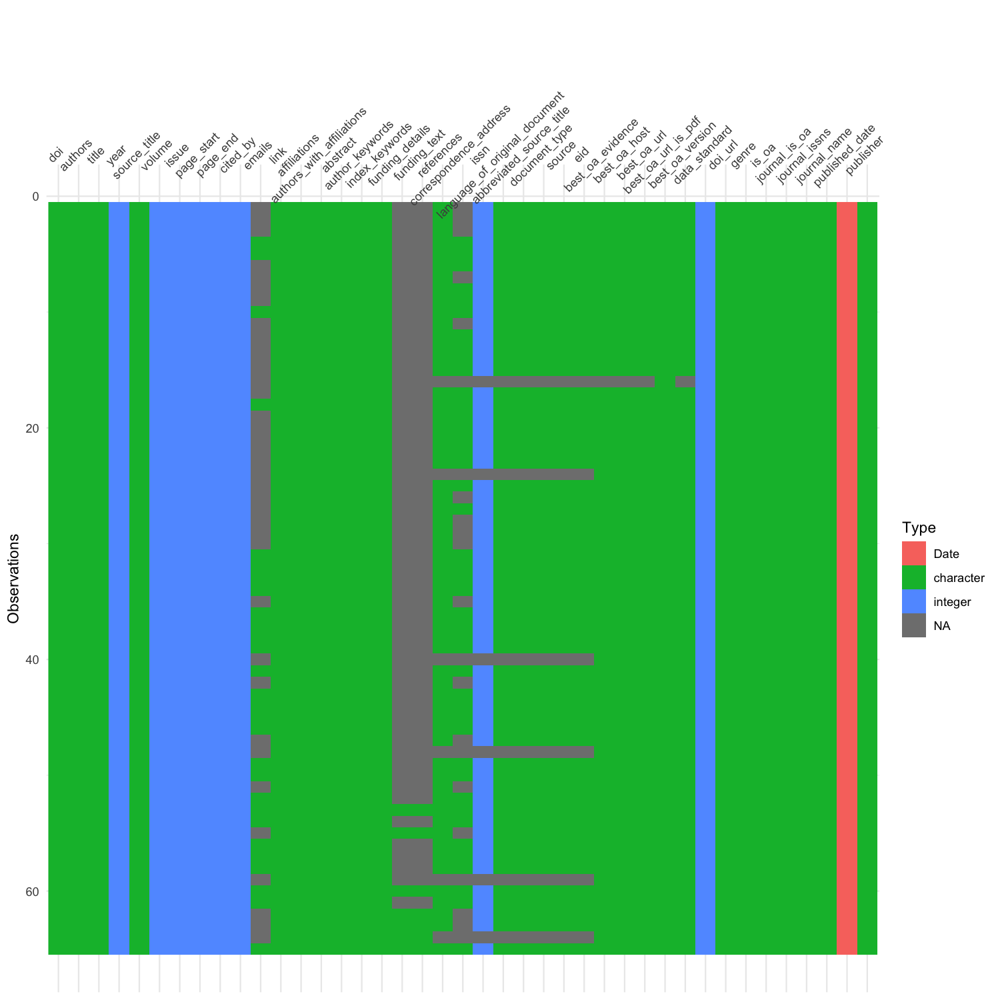

```bash

# found a block of rows right shifted by a column in the bottom half of the Scopus CSV data.
# to avoid parsing it later, the csv is renamed with "raw" tag.

mv BulletinofGeosciences_Scopus.csv BulletinofGeosciences_Scopus.raw.csv

# the misalignment can be seen in the BulletinofGeosciences_Scopus.raw.csv.png

```

The right shifted block can be seen in BulletinofGeosciences\_Scopus.raw.csv.png


```bash

# make a copy of the raw scopus data
cp BulletinofGeosciences_Scopus.raw.csv BulletinofGeosciences_Scopus.csv

# open BulletinofGeosciences_Scopus.csv is MS-Excel and re-align the block manually
# save the data in CSV format with UTF-8 encoding
# inspect this file with visdat package again to verify the correction
# see BulletinofGeosciences_Scopus.csv.png

```

Post correction: BulletinofGeosciences\_Scopus.csv.png


```bash

# now this csv file is cleaned with Janitor package to produce the following three tsv files
17-Bulletin_of_Geosciences_Combined_Scopus_Unpaywall.tsv
17-Bulletin_of_Geosciences_Scopus.tsv
17-Bulletin_of_Geosciences_Unpaywall.tsv

# again these tsv files are visually inspected with visdat package
17-Bulletin_of_Geosciences_Combined_Scopus_Unpaywall.tsv.png
17-Bulletin_of_Geosciences_Scopus.tsv.png
17-Bulletin_of_Geosciences_Unpaywall.tsv.png

```

Merged Scopus and Unpaywall data: 17-Bulletin\_of\_Geosciences\_Combined\_Scopus\_Unpaywall.tsv

