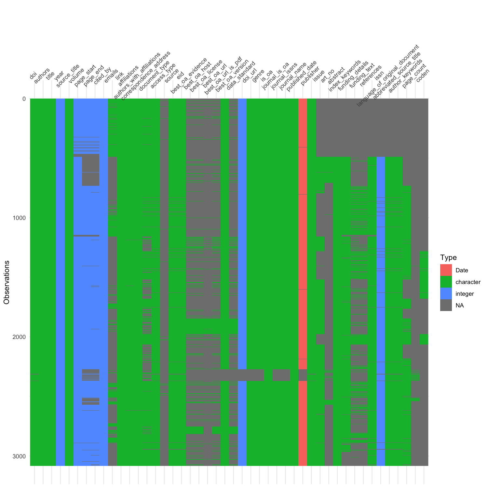

Raw journal data obtained from Scopus. PLOS ONE data from the Rplos package.

```bash

# create soft link of journal-wise combined scopus and unpaywall data in the current directory
$ ln -s */*_Combined_Scopus_Unpaywall.tsv .

```

```r

# run the following step in R to read and merge paleo journals data into one master file
$ R
> load tidyverse packages
> require(tidyverse)
>
> # get the paleo journals file list
> tsv_files <- list.files(pattern="*_Combined_Scopus_Unpaywall.tsv")
>
> # read files with readr and merge data frames using dplyr map_dfr
> merged_paleo_journals_data <- tsv_files %>% map_dfr(read_tsv, col_types = cols(.default = "c"))
>
> # write the merged data frame in TSV format using readr
> write_tsv(merged_paleo_journals_data, path="paleo_journals_scopus_unpaywall_data.tsv")
> q()

```

```bash
# # unlink the soft-links of individual paleo journals data
# $ for tsv in *_Combined_Scopus_Unpaywall.tsv; do unlink $tsv; done;
# For now, the soft links are retained

# visually inspect the merged paleo journals data with visdat package
$ Rscript ../../scripts/visually_explore_tsv_with_visdat_plots.R paleo_journals_scopus_unpaywall_data.tsv 10 10 150
```

Paleo Journals: Scopus and Unpaywall Data Visdat View

